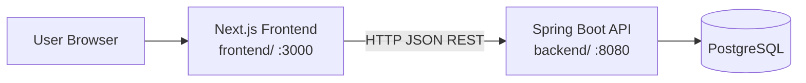
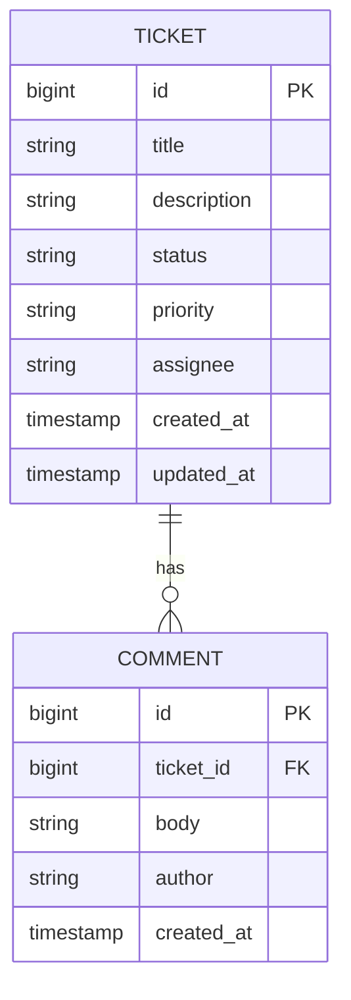

# Architecture

**Status:** Approved — GATE 3  
**Source:** `spec/requirements.md` (REQ-TECH-*, DEC-01 – DEC-16)  
**Last updated:** 2026-09-24

This document defines *how* the Support Ticket Management System is structured. It does not define API payloads, entity schemas, or UI wireframes — those belong in downstream specs.

---

## 1. Architectural Goals

| Goal | Requirement trace |
|------|-------------------|
| Meet assignment technology stack | REQ-TECH-01 – REQ-TECH-06 |
| Enforce ticket state machine server-side | REQ-SM-10, DEC-10 |
| Persist data across restarts | REQ-NFR-01, REQ-FUNC-11 |
| Support SDD incremental delivery | REQ-SDD-04, DEC-16 |
| Keep scope minimal — no auth, no over-engineering | DEC-06, Section 2.3 requirements |

---

## 2. System Context

A browser-based UI talks to a Spring Boot REST API, which persists ticket and comment data in PostgreSQL.



### 2.1 Boundaries

| Component | Responsibility | Not responsible for |
|-----------|----------------|---------------------|
| **Frontend** | UI, client-side validation (UX), API calls, error display | State machine rules, persistence, authoritative validation |
| **Backend** | REST API, validation, state machine, persistence, error responses | Rendering UI |
| **PostgreSQL** | Durable storage | Business logic |

### 2.2 Authentication

**None** (DEC-06). The API is open within the deployment environment. This is acceptable for the assessment/demo scope. Production hardening (auth, HTTPS-only, network isolation) is out of scope unless requirements change.

---

## 3. Repository Layout

Monorepo per **DEC-16**:

```text
support-ticket-system/
├── .cursor/                 # AI rules, commands, skills (GATE 1)
├── backend/                 # Spring Boot application (Java 21, Maven)
├── frontend/                # Next.js application (TypeScript)
├── spec/                    # Specifications (SDD artefacts)
├── docs/                    # Prompt history, supplementary docs
├── .specstory/              # SpecStory captures
├── docker-compose.yml       # Optional: local PostgreSQL (recommended)
├── .env.example             # Documented env vars — no secrets
└── README.md                # How to run backend, frontend, DB
```

`backend/` and `frontend/` are **not created until implementation gates**. This architecture spec defines their intended structure only.

---

## 4. Technology Stack

### 4.1 Backend

| Layer | Choice | Notes |
|-------|--------|-------|
| Language | Java 21 | REQ-TECH-01 |
| Framework | Spring Boot 3.x | REQ-TECH-02; 3.x required for Jakarta EE / Java 21 |
| API style | REST (JSON) | REQ-TECH-03 |
| Web | Spring Web (`spring-boot-starter-web`) | REST controllers |
| Persistence | Spring Data JPA | REQ-TECH-04 |
| Database (runtime) | PostgreSQL 16+ | REQ-TECH-04 |
| Database (tests) | H2 in-memory | REQ-TECH-05; integration tests |
| Migrations | Flyway | DEC-15 |
| Validation | Jakarta Bean Validation | REQ-FUNC-12 |
| Build | Maven | DEC-15 |
| Logging | SLF4J / Logback (Spring Boot default) | Per `.cursor/rules/java-springboot.mdc` |

**Pin exact dependency versions** in `backend/pom.xml` at implementation time (GATE 10).

### 4.2 Frontend

| Layer | Choice | Notes |
|-------|--------|-------|
| Framework | Next.js (App Router) | DEC-11, REQ-TECH-06 |
| Language | TypeScript | DEC-11 |
| UI | React 19 (via Next.js) | REQ-TECH-06 |
| Styling | CSS Modules or Tailwind CSS | Implementation choice; prefer simplicity |
| HTTP client | `fetch` (native) | No extra HTTP library unless justified |
| Node | LTS version supported by chosen Next.js release | Document in README at implementation |

### 4.3 Development Tooling

| Tool | Purpose |
|------|---------|
| Cursor | Primary IDE (REQ-TECH-07) |
| GitHub Copilot | Optional assist (REQ-TECH-07) |
| Docker Compose | Optional local PostgreSQL |
| Maven Wrapper (`mvnw`) | Reproducible backend builds |
| npm / pnpm | Frontend package management (pick one at implementation) |

---

## 5. Backend Architecture

### 5.1 Layered Design

```
HTTP Request
    ↓
Controller   — routing, DTO binding, HTTP status codes
    ↓
Service      — business rules, state machine, transactions
    ↓
Repository   — JPA data access
    ↓
PostgreSQL
```

Aligned with `.cursor/rules/java-springboot.mdc`. No additional layers (facades, generic bases) unless a later spec explicitly requires them.

### 5.2 Package Structure

Base package: `com.supportticket`

```text
com.supportticket
├── SupportTicketApplication.java
├── config/              # CORS, Jackson, OpenAPI (optional)
├── controller/          # REST endpoints
├── dto/
│   ├── request/         # Incoming payloads (@Valid)
│   └── response/        # Outgoing payloads
├── entity/              # JPA entities
├── exception/           # Domain exceptions + @RestControllerAdvice
├── repository/          # Spring Data JPA interfaces
├── service/             # Business logic
│   └── status/          # State machine (TicketStatusService)
└── validation/          # Custom validators if needed
```

### 5.3 Core Components

| Component | Responsibility |
|-----------|----------------|
| `TicketController` | Ticket CRUD, list with search/filter, status transition endpoint |
| `CommentController` | Add comment to ticket; list comments for ticket |
| `TicketService` | Create/update ticket fields; orchestrate list/search/filter |
| `TicketStatusService` | Validate and apply status transitions (DEC-10, REQ-SM-*) |
| `CommentService` | Append comments (DEC-05) |
| `TicketRepository` | Ticket persistence + search/filter queries |
| `CommentRepository` | Comment persistence |
| `GlobalExceptionHandler` | Map exceptions to API error format per `.cursor/rules/api-standards.mdc` |

### 5.4 State Machine Placement

Status transition logic lives **only** in `TicketStatusService` (or equivalent dedicated service), invoked by a **dedicated controller endpoint** (DEC-10). `TicketService` update methods must reject or ignore any attempt to change `status` via field update.

### 5.5 Persistence Strategy

| Concern | Approach |
|---------|----------|
| Schema ownership | Flyway SQL migrations in `backend/src/main/resources/db/migration/` |
| ORM | JPA entities map to Flyway-created tables |
| `ddl-auto` | `validate` for PostgreSQL runtime; `none` or `create-drop` only in isolated test profile |
| IDs | Database-generated `BIGSERIAL` / `IDENTITY` for tickets and comments |
| Timestamps | `createdAt` set on insert; `updatedAt` updated on ticket modification (DEC-04) |
| Search | JPA `@Query` or Spring Data method with `LOWER()` for case-insensitive match on title + description (DEC-09) |

Detailed column definitions: `spec/data-model.md` (GATE 4).

### 5.6 Spring Profiles

| Profile | Purpose | Database |
|---------|---------|----------|
| `local` | Developer workstation | PostgreSQL (Docker Compose) |
| `test` | `@SpringBootTest`, integration tests | H2 in-memory |
| `prod` | Production-like deployment | PostgreSQL via env config |

Configuration files:

```text
backend/src/main/resources/
├── application.yml              # Shared defaults
├── application-local.yml        # Local PostgreSQL connection
├── application-test.yml         # H2 test datasource
└── db/migration/                # Flyway scripts
```

### 5.7 Cross-Cutting Concerns

| Concern | Approach |
|---------|----------|
| **Validation** | `@Valid` on request DTOs; business rules in services |
| **Errors** | `@RestControllerAdvice`; structured JSON per API standards |
| **CORS** | Allow frontend origin (`http://localhost:3000`) in `local` profile |
| **Logging** | INFO for business events; WARN/ERROR for failures; no secrets in logs |
| **Transactions** | `@Transactional` on service methods that write data |

---

## 6. Frontend Architecture

### 6.1 App Router Structure

```text
frontend/
├── src/
│   ├── app/
│   │   ├── layout.tsx           # Root layout, global styles
│   │   ├── page.tsx             # Ticket list (search + filter)
│   │   ├── tickets/
│   │   │   ├── new/
│   │   │   │   └── page.tsx     # Create ticket
│   │   │   └── [id]/
│   │   │       └── page.tsx     # Ticket detail + comments + status
│   │   └── globals.css
│   ├── components/
│   │   ├── TicketList.tsx
│   │   ├── TicketForm.tsx
│   │   ├── TicketDetail.tsx
│   │   ├── CommentList.tsx
│   │   ├── CommentForm.tsx
│   │   ├── StatusTransition.tsx
│   │   └── ErrorMessage.tsx
│   ├── lib/
│   │   ├── api/                 # API client functions
│   │   │   ├── client.ts        # Base fetch wrapper + error parsing
│   │   │   ├── tickets.ts
│   │   │   └── comments.ts
│   │   └── types/               # TypeScript types mirroring API DTOs
│   │       └── ticket.ts
│   └── hooks/                   # Optional: useTickets, etc.
├── public/
├── next.config.ts
├── package.json
└── tsconfig.json
```

### 6.2 Frontend Responsibilities

| Area | Approach |
|------|----------|
| **Data fetching** | Server Components or client `fetch` to backend API; keep API base URL in `NEXT_PUBLIC_API_URL` |
| **Forms** | Client-side required-field checks for UX; trust backend for authoritative validation (REQ-FUNC-12) |
| **Errors** | Parse API error JSON; display field errors and general messages (REQ-FUNC-13, DEC-08) |
| **Status changes** | `StatusTransition` calls dedicated status endpoint only (DEC-10) |
| **List view** | Show id, title, status, priority, assignee, updatedAt (DEC-13); search + filter combinable (DEC-07) |

### 6.3 API Client Pattern

Centralise HTTP in `lib/api/client.ts`:

- Prefix requests with `NEXT_PUBLIC_API_URL` (default `http://localhost:8080`)
- Parse JSON error bodies into a typed `ApiError` for UI display
- No authentication headers (DEC-06)

---

## 7. Integration & Communication

### 7.1 API Base URL

| Environment | Frontend | Backend API |
|-------------|----------|-------------|
| Local dev | `http://localhost:3000` | `http://localhost:8080/api` |

Backend serves REST under `/api` prefix (per `.cursor/rules/api-standards.mdc`).

### 7.2 CORS

Backend enables CORS for the frontend origin in `local` profile:

- Allowed methods: `GET`, `POST`, `PATCH`
- Allowed headers: `Content-Type`
- Credentials: not required (no auth)

### 7.3 Data Format

- Request/response: `application/json`
- Dates: ISO-8601 UTC strings (DEC-04)
- Enums: string values (`OPEN`, `LOW`, etc.)

Endpoint details: `spec/api-contract.md` (GATE 5).

---

## 8. Data Architecture (Overview)



- **Ticket** and **Comment** are separate tables (DEC-05).
- **No user table** (DEC-02, DEC-06).
- Full schema, indexes, and constraints: `spec/data-model.md` (GATE 4).

---

## 9. Local Development Topology

Recommended local setup:

```text
Terminal 1:  docker compose up -d          # PostgreSQL on :5432
Terminal 2:  cd backend && ./mvnw spring-boot:run -Dspring-boot.run.profiles=local
Terminal 3:  cd frontend && npm run dev    # :3000
```

### 9.1 Docker Compose (recommended)

Optional `docker-compose.yml` at repo root:

- Service: `postgres` (image `postgres:16-alpine`)
- Port: `5432`
- Volume: named volume for data persistence across restarts (AC-13)
- Credentials: via `.env` file (gitignored); defaults documented in `.env.example`

### 9.2 Environment Variables

| Variable | Component | Example | Committed? |
|----------|-----------|---------|------------|
| `SPRING_DATASOURCE_URL` | Backend | `jdbc:postgresql://localhost:5432/support_tickets` | No — `.env.example` only |
| `SPRING_DATASOURCE_USERNAME` | Backend | `support` | No |
| `SPRING_DATASOURCE_PASSWORD` | Backend | `support` | No |
| `NEXT_PUBLIC_API_URL` | Frontend | `http://localhost:8080` | No — `.env.local.example` |

**REQ-TECH-08:** Never commit real credentials.

---

## 10. Testing Architecture (Overview)

Detailed strategy: `spec/test-strategy.md` (GATE 8). Summary:

| Layer | Location | Database |
|-------|----------|----------|
| Unit tests | `backend/src/test/.../service/` | Mocked repositories |
| Integration tests | `backend/src/test/.../integration/` | H2 (`test` profile) |
| State machine tests | `backend/src/test/.../integration/TicketStatusIntegrationTest` | H2; mandatory per REQ-NFR-04 |
| API tests | MockMvc or `@SpringBootTest` + TestRestTemplate | H2 |
| Frontend tests | Optional; manual acceptance sufficient for assessment minimum | — |

Tests run via `./mvnw test` in `backend/`. Frontend test scope decided at GATE 8.

---

## 11. Deployment View (Assessment Scope)

For the assessment, **local deployment only** is required. No cloud/Kubernetes spec.

| Artifact | Output |
|----------|--------|
| Backend JAR | `backend/target/*.jar` via `mvnw package` |
| Frontend | `frontend/.next` dev server; static export not required |

Production deployment patterns (container images, CI/CD) are out of scope unless added later.

---

## 12. Security Architecture

| Topic | Decision |
|-------|----------|
| Authentication | None (DEC-06) |
| Authorization | None |
| Secrets | Environment variables only (REQ-TECH-08) |
| Input validation | Backend mandatory (REQ-FUNC-12) |
| Error leakage | No stack traces to clients (API standards) |
| CORS | Restricted to known frontend origin in dev |

---

## 13. Requirements Traceability

| Requirement / Decision | Architectural element |
|------------------------|----------------------|
| REQ-TECH-01 – 05 | Section 4.1, 5, 8, 9 |
| REQ-TECH-06 | Section 6 |
| REQ-TECH-08 | Section 9.2, 12 |
| DEC-10 | Section 5.4, 6.2 |
| DEC-11 | Section 4.2, 6 |
| DEC-15 | Section 4.1, 5.5 |
| DEC-16 | Section 3 |
| REQ-SM-10 | `TicketStatusService` server-side |
| REQ-NFR-01 | PostgreSQL + Flyway; Docker volume |
| REQ-NFR-04 | Section 10 |

---

## 14. Out of Scope (Architecture)

- API gateway, load balancer, service mesh
- Caching (Redis)
- Message queues
- Multi-instance backend
- CI/CD pipelines (may be added later without architecture change)
- OpenAPI/Swagger UI (optional nice-to-have; not required for assessment)

---

## 15. Gate Approval

| Gate | Document | Status |
|------|----------|--------|
| GATE 1 | Project structure & AI instructions | **Approved** |
| GATE 2 | `spec/requirements.md` | **Approved** |
| GATE 3 | This document (`spec/architecture.md`) | **Approved** (2026-09-24) |
| GATE 4 | `spec/data-model.md` | **Approved** (2026-09-24) |
| GATE 5 | `spec/api-contract.md` | Not started |
| GATE 6 | `spec/state-machine.md` | Not started |
| GATE 7 | `spec/ui-flow.md` | Not started |
| GATE 8 | `spec/test-strategy.md` | Not started |

---

## 16. Revision History

| Date | Change | Gate |
|------|--------|------|
| 2026-09-24 | Initial architecture draft | GATE 3 |
| 2026-09-24 | GATE 3 approved | GATE 3 |
