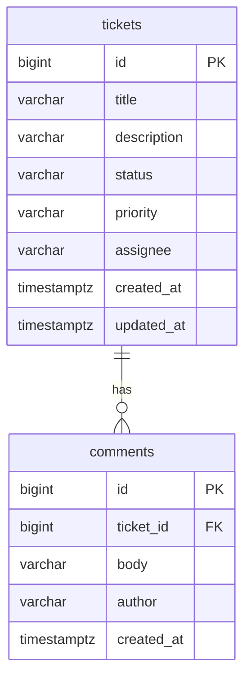

# Data Model

**Status:** Approved — GATE 4  
**Source:** `spec/requirements.md` (DEC-01 – DEC-09), `spec/architecture.md`  
**Last updated:** 2026-09-24

This document defines persistent entities, fields, constraints, relationships, indexes, and migration strategy. API field names and HTTP behaviour belong in `spec/api-contract.md` (GATE 5).

---

## 1. Overview

The system has **two entities**:

| Entity | Table | Purpose |
|--------|-------|---------|
| **Ticket** | `tickets` | Core support ticket record |
| **Comment** | `comments` | Append-only notes on a ticket (DEC-05) |

There is **no user table** (DEC-02, DEC-06). Assignee and comment author are optional free-text columns.



---

## 2. Naming Conventions

| Layer | Convention | Example |
|-------|------------|---------|
| Database tables | `snake_case`, plural | `tickets`, `comments` |
| Database columns | `snake_case` | `created_at`, `ticket_id` |
| JPA entities | `PascalCase` singular | `Ticket`, `Comment` |
| JPA fields | `camelCase` | `createdAt`, `ticketId` |
| API JSON | `camelCase` | `createdAt`, `ticketId` |
| Enum values | `UPPER_SNAKE` strings | `IN_PROGRESS`, `MEDIUM` |

Flyway scripts use PostgreSQL syntax. H2 test profile uses compatible types (`TIMESTAMP WITH TIME ZONE` or `TIMESTAMP` — H2 maps appropriately in test migrations or shared dialect-neutral DDL where possible).

---

## 3. Enumerations

Stored as `VARCHAR` in the database with `CHECK` constraints. Mapped to Java `enum` types in JPA.

### 3.1 `TicketStatus`

| Value | Description | Set on create? |
|-------|-------------|----------------|
| `OPEN` | Initial state | Yes — default (DEC-03) |
| `IN_PROGRESS` | Actively worked | Via status transition only |
| `RESOLVED` | Work completed | Via status transition only |
| `CLOSED` | Closed | Via status transition only |
| `CANCELLED` | Cancelled | Via status transition only |

Valid transitions: see `spec/state-machine.md` (GATE 6). Status is **not** writable via ticket field update (DEC-10).

### 3.2 `TicketPriority`

| Value | Description |
|-------|-------------|
| `LOW` | Low priority |
| `MEDIUM` | Default on create (DEC-01) |
| `HIGH` | High priority |

---

## 4. Entity: Ticket

### 4.1 Table: `tickets`

| Column | SQL type | Nullable | Default | Constraints | Notes |
|--------|----------|----------|---------|-------------|-------|
| `id` | `BIGINT` | NO | generated | `PRIMARY KEY` | `GENERATED ALWAYS AS IDENTITY` |
| `title` | `VARCHAR(200)` | NO | — | length 1–200 | DEC-08 |
| `description` | `VARCHAR(5000)` | NO | — | length 1–5000 | DEC-08 |
| `status` | `VARCHAR(20)` | NO | `'OPEN'` | `CHECK` enum | DEC-03; app-enforced transitions |
| `priority` | `VARCHAR(10)` | NO | `'MEDIUM'` | `CHECK` enum | DEC-01 |
| `assignee` | `VARCHAR(100)` | YES | `NULL` | max 100 chars | DEC-02; `NULL` = unassigned |
| `created_at` | `TIMESTAMPTZ` | NO | — | — | Set once on insert (DEC-04) |
| `updated_at` | `TIMESTAMPTZ` | NO | — | — | Updated on ticket/comment activity (see §7) |

### 4.2 DDL (PostgreSQL / Flyway)

```sql
CREATE TABLE tickets (
    id              BIGINT GENERATED ALWAYS AS IDENTITY PRIMARY KEY,
    title           VARCHAR(200)  NOT NULL,
    description     VARCHAR(5000) NOT NULL,
    status          VARCHAR(20)   NOT NULL DEFAULT 'OPEN',
    priority        VARCHAR(10)   NOT NULL DEFAULT 'MEDIUM',
    assignee        VARCHAR(100),
    created_at      TIMESTAMPTZ   NOT NULL,
    updated_at      TIMESTAMPTZ   NOT NULL,
    CONSTRAINT chk_tickets_status CHECK (
        status IN ('OPEN', 'IN_PROGRESS', 'RESOLVED', 'CLOSED', 'CANCELLED')
    ),
    CONSTRAINT chk_tickets_priority CHECK (
        priority IN ('LOW', 'MEDIUM', 'HIGH')
    )
);
```

### 4.3 JPA Entity Sketch

```java
@Entity
@Table(name = "tickets")
public class Ticket {
    @Id
    @GeneratedValue(strategy = GenerationType.IDENTITY)
    private Long id;

    @Column(nullable = false, length = 200)
    private String title;

    @Column(nullable = false, length = 5000)
    private String description;

    @Enumerated(EnumType.STRING)
    @Column(nullable = false, length = 20)
    private TicketStatus status;

    @Enumerated(EnumType.STRING)
    @Column(nullable = false, length = 10)
    private TicketPriority priority;

    @Column(length = 100)
    private String assignee;

    @Column(name = "created_at", nullable = false, updatable = false)
    private Instant createdAt;

    @Column(name = "updated_at", nullable = false)
    private Instant updatedAt;

    @OneToMany(mappedBy = "ticket", cascade = CascadeType.ALL, orphanRemoval = false)
    @OrderBy("createdAt ASC")
    private List<Comment> comments = new ArrayList<>();
}
```

Implementation may use Lombok or records for DTOs only — entities remain mutable JPA classes.

### 4.4 Field Validation (Application Layer)

Mirrors DEC-08; enforced via Jakarta Validation on request DTOs **and** service-layer guards:

| Field | Create | Update | Rules |
|-------|--------|--------|-------|
| `title` | Required | Optional in PATCH | Trim whitespace; 1–200 chars after trim |
| `description` | Required | Optional in PATCH | Trim; 1–5000 chars after trim |
| `priority` | Required (default `MEDIUM` if omitted) | Optional in PATCH | Must be valid enum |
| `assignee` | Optional | Optional in PATCH | Trim; empty → `NULL`; max 100 chars |
| `status` | **Ignored** on create (always `OPEN`) | **Rejected** on field update (DEC-10) | Status via dedicated endpoint only |

---

## 5. Entity: Comment

### 5.1 Table: `comments`

| Column | SQL type | Nullable | Default | Constraints | Notes |
|--------|----------|----------|---------|-------------|-------|
| `id` | `BIGINT` | NO | generated | `PRIMARY KEY` | `GENERATED ALWAYS AS IDENTITY` |
| `ticket_id` | `BIGINT` | NO | — | `FK → tickets(id)` | Parent ticket |
| `body` | `VARCHAR(2000)` | NO | — | length 1–2000 | DEC-08 |
| `author` | `VARCHAR(100)` | YES | `NULL` | max 100 chars | DEC-08; optional |
| `created_at` | `TIMESTAMPTZ` | NO | — | — | Set on insert; immutable |

### 5.2 DDL (PostgreSQL / Flyway)

```sql
CREATE TABLE comments (
    id          BIGINT GENERATED ALWAYS AS IDENTITY PRIMARY KEY,
    ticket_id   BIGINT        NOT NULL,
    body        VARCHAR(2000) NOT NULL,
    author      VARCHAR(100),
    created_at  TIMESTAMPTZ   NOT NULL,
    CONSTRAINT fk_comments_ticket
        FOREIGN KEY (ticket_id) REFERENCES tickets (id)
        ON DELETE RESTRICT
);

CREATE INDEX idx_comments_ticket_id ON comments (ticket_id);
```

`ON DELETE RESTRICT`: ticket deletion is out of scope; prevents orphan comments if deletion is attempted later.

### 5.3 JPA Entity Sketch

```java
@Entity
@Table(name = "comments")
public class Comment {
    @Id
    @GeneratedValue(strategy = GenerationType.IDENTITY)
    private Long id;

    @ManyToOne(fetch = FetchType.LAZY, optional = false)
    @JoinColumn(name = "ticket_id", nullable = false)
    private Ticket ticket;

    @Column(nullable = false, length = 2000)
    private String body;

    @Column(length = 100)
    private String author;

    @Column(name = "created_at", nullable = false, updatable = false)
    private Instant createdAt;
}
```

### 5.4 Field Validation

| Field | Rules |
|-------|-------|
| `body` | Required; trim; 1–2000 chars after trim |
| `author` | Optional; trim; empty → `NULL`; max 100 chars |
| `ticketId` | Must reference existing ticket (404 if not found) |

Comments are **append-only** (DEC-05): no `updated_at`, no update/delete API.

---

## 6. Indexes

| Index | Table | Column(s) | Purpose |
|-------|-------|-----------|---------|
| `PK` | `tickets` | `id` | Primary key lookups |
| `idx_tickets_status` | `tickets` | `status` | Status filter (REQ-FUNC-10, DEC-07) |
| `idx_tickets_updated_at` | `tickets` | `updated_at DESC` | List sort default (DEC-04) |
| `PK` | `comments` | `id` | Primary key |
| `idx_comments_ticket_id` | `comments` | `ticket_id` | Load comments for ticket |

### 6.1 Search (DEC-09)

Keyword search uses case-insensitive substring match on `title` and `description`:

```sql
WHERE LOWER(title) LIKE LOWER(CONCAT('%', :search, '%'))
   OR LOWER(description) LIKE LOWER(CONCAT('%', :search, '%'))
```

No full-text search index for this exercise (DEC-12 unpaginated list; assessment scope). A sequential scan is acceptable.

Optional combined filter:

```sql
AND (:status IS NULL OR status = :status)
```

---

## 7. Persistence Behaviour

| Event | `tickets.created_at` | `tickets.updated_at` | `comments.created_at` |
|-------|----------------------|----------------------|------------------------|
| Create ticket | Set to `now()` | Set to `now()` | — |
| Update ticket fields | Unchanged | Set to `now()` | — |
| Status transition | Unchanged | Set to `now()` | — |
| Add comment | Unchanged | Set to `now()` | Set to `now()` |

**DM-01:** Adding a comment updates the parent ticket's `updated_at` so the ticket list reflects recent activity (supports DEC-04 sort).

Timestamps are stored in **UTC** (`Instant` in Java, `TIMESTAMPTZ` in PostgreSQL). API serialises as ISO-8601 UTC strings.

### 7.1 Normalisation Rules

| Input | Stored value |
|-------|--------------|
| `assignee: ""` or whitespace only | `NULL` |
| `author: ""` or whitespace only | `NULL` |
| `title` / `description` / `body` | Trimmed leading/trailing whitespace |

### 7.2 Default Values on Create

| Field | Default |
|-------|---------|
| `status` | `OPEN` (DEC-03) — not client-supplied |
| `priority` | `MEDIUM` if omitted (DEC-01) |
| `assignee` | `NULL` |

---

## 8. Flyway Migrations

Location: `backend/src/main/resources/db/migration/` (DEC-15)

| Version | File | Contents |
|---------|------|----------|
| `V1` | `V1__create_tickets_table.sql` | `tickets` table + checks + indexes |
| `V2` | `V2__create_comments_table.sql` | `comments` table + FK + index |

Alternatively, a single `V1__init_schema.sql` combining both is acceptable if preferred at implementation — document choice in README.

### 8.1 H2 Compatibility (Test Profile)

Integration tests use H2 (REQ-TECH-05). Options (choose one at implementation):

1. **Same Flyway scripts** with PostgreSQL-compatible DDL (preferred — `IDENTITY`, `TIMESTAMPTZ` supported in recent H2).
2. **Test-only Flyway location** if dialect differences arise — avoid unless necessary.

`spring.jpa.hibernate.ddl-auto=validate` for PostgreSQL runtime; tests may use `create-drop` only if Flyway is disabled in test profile — **prefer Flyway in tests** for parity.

---

## 9. Repository Query Requirements

`TicketRepository` must support:

| Operation | Method shape (illustrative) | Spec ref |
|-----------|----------------------------|----------|
| Find by id | `findById(Long id)` | REQ-FUNC-03 |
| List all (sorted) | `findAllByOrderByUpdatedAtDesc()` | DEC-04, DEC-12 |
| Filter by status | `findByStatusOrderByUpdatedAtDesc(TicketStatus status)` | REQ-FUNC-10 |
| Search | Custom `@Query` with `LOWER` + `LIKE` on title/description | DEC-09 |
| Search + filter | Combined `@Query` with optional status param | DEC-07 |

`CommentRepository` must support:

| Operation | Method shape |
|-----------|--------------|
| Find by ticket | `findByTicketIdOrderByCreatedAtAsc(Long ticketId)` |
| Save | `save(Comment comment)` |

---

## 10. Data Integrity Summary

| Rule | Enforced by |
|------|-------------|
| Valid `status` values | DB `CHECK` + Java enum |
| Valid `priority` values | DB `CHECK` + Java enum |
| Valid status **transitions** | `TicketStatusService` only (not DB) |
| Title/description length | DB column limit + Bean Validation |
| Comment belongs to ticket | FK `ticket_id` |
| No ticket delete | No API; `ON DELETE RESTRICT` on FK |
| Status not via field PATCH | Service layer rejects (DEC-10) |

---

## 11. Requirements Traceability

| Requirement / Decision | Data model element |
|------------------------|-------------------|
| REQ-FUNC-01 | `tickets` table |
| REQ-FUNC-08 | `comments` table |
| REQ-FUNC-09 | Search query on `title`, `description` |
| REQ-FUNC-10 | `idx_tickets_status` |
| REQ-FUNC-11 | PostgreSQL persistence via Flyway |
| DEC-01 | `priority` enum + default `MEDIUM` |
| DEC-02 | `assignee` nullable `VARCHAR(100)` |
| DEC-03 | `status` default `OPEN` |
| DEC-04 | `created_at`, `updated_at` |
| DEC-05 | Comments append-only (no update columns) |
| DEC-08 | Column lengths and validation table §4.4, §5.4 |
| DEC-09 | Search fields §6.1 |
| DEC-15 | Flyway migrations §8 |

---

## 12. Out of Scope

- Soft delete / `deleted_at` columns
- Ticket history / audit tables
- User or team tables
- Attachment storage
- Full-text search indexes (`pg_trgm`, GIN)
- Database-level state transition triggers (logic stays in Java service)

---

## 13. Gate Approval

| Gate | Document | Status |
|------|----------|--------|
| GATE 1 | Project structure & AI instructions | **Approved** |
| GATE 2 | `spec/requirements.md` | **Approved** |
| GATE 3 | `spec/architecture.md` | **Approved** |
| GATE 4 | This document (`spec/data-model.md`) | **Approved** (2026-09-24) |
| GATE 5 | `spec/api-contract.md` | **Approved** (2026-09-24) |
| GATE 6 | `spec/state-machine.md` | Not started |
| GATE 7 | `spec/ui-flow.md` | Not started |
| GATE 8 | `spec/test-strategy.md` | Not started |

---

## 14. Revision History

| Date | Change | Gate |
|------|--------|------|
| 2026-09-24 | Initial data model draft | GATE 4 |
| 2026-09-24 | GATE 4 approved | GATE 4 |
