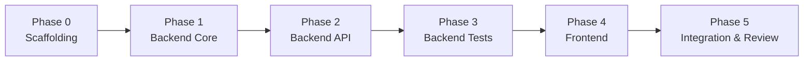
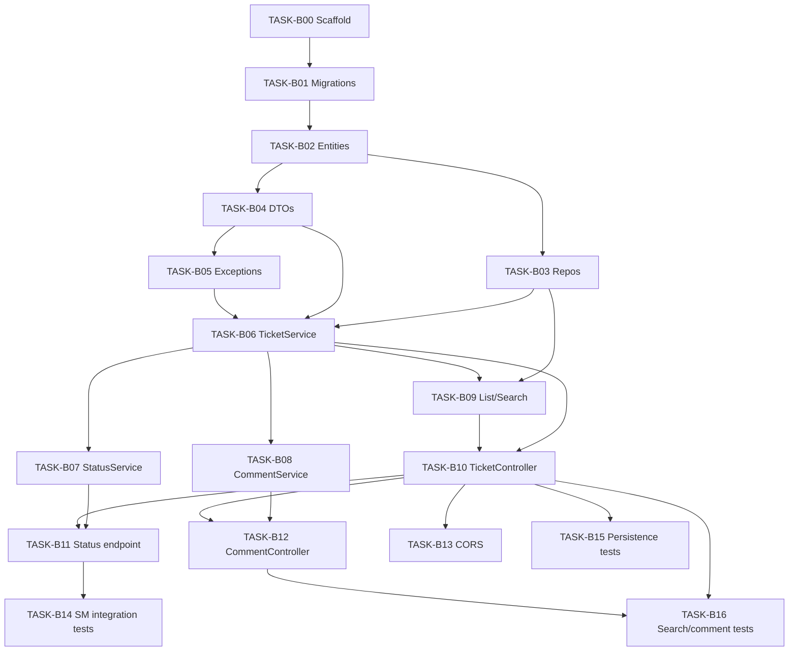

# Implementation Plan

**Status:** Approved — GATE 9  
**Source:** All approved specs (`spec/requirements.md` through `spec/test-strategy.md`)  
**Last updated:** 2026-09-24

Breaks implementation into **small, independently approvable tasks**. Each task must be explicitly approved before work begins. Do not batch multiple tasks without human sign-off.

---

## 1. Plan Principles

| Principle | Detail |
|-----------|--------|
| **Spec-first** | Every task traces to approved spec sections |
| **Incremental** | Each task produces a verifiable increment |
| **Test alongside** | Backend tasks include tests per `spec/test-strategy.md` |
| **One task at a time** | Human approves task → implement → review → next task |
| **No scope creep** | Out-of-scope items from requirements stay out |

---

## 2. Phase Overview



| Phase | GATE | Focus | Tasks |
|-------|------|-------|-------|
| **0** | 10 (start) | Repo scaffolding, tooling | TASK-B00, TASK-I00 |
| **1** | 10 | Persistence, domain, services | TASK-B01 – B09 |
| **2** | 10 | REST API, CORS, config | TASK-B10 – B14 |
| **3** | 10 | Automated tests | TASK-B15 – B17 |
| **4** | 11 | Next.js UI | TASK-F01 – F10 |
| **5** | 12 – 13 | E2E verification, review | TASK-I01 – I03 |

---

## 3. Phase 0 — Scaffolding

### TASK-B00: Backend project scaffold

| Attribute | Detail |
|-----------|--------|
| **Depends on** | GATE 9 approval |
| **Spec refs** | `architecture.md` §3–5, DEC-15, DEC-16 |
| **Deliverables** | `backend/pom.xml`, `SupportTicketApplication`, package structure, `application.yml`, Maven wrapper, `.gitignore` updates |
| **Tests** | Application context smoke test (`@SpringBootTest` loads) |
| **Done when** | `./mvnw test` passes; no business features yet |

### TASK-I00: Dev environment bootstrap

| Attribute | Detail |
|-----------|--------|
| **Depends on** | TASK-B00 |
| **Spec refs** | `architecture.md` §9 |
| **Deliverables** | `docker-compose.yml`, `.env.example`, root `README.md` (run instructions skeleton) |
| **Tests** | Manual: PostgreSQL container starts |
| **Done when** | `docker compose up -d` works; README documents ports |

---

## 4. Phase 1 — Backend Core

### TASK-B01: Database migrations

| Attribute | Detail |
|-----------|--------|
| **Depends on** | TASK-B00 |
| **Spec refs** | `data-model.md` §4–5, §8 |
| **Deliverables** | `V1__create_tickets_table.sql`, `V2__create_comments_table.sql`, Flyway config |
| **Tests** | Flyway runs on test profile without error |
| **Done when** | Tables exist in H2/PostgreSQL with constraints |

### TASK-B02: JPA entities

| Attribute | Detail |
|-----------|--------|
| **Depends on** | TASK-B01 |
| **Spec refs** | `data-model.md` §4.3, §5.3 |
| **Deliverables** | `Ticket`, `Comment` entities; `TicketStatus`, `TicketPriority` enums |
| **Tests** | None required yet (or `@DataJpaTest` save/load smoke) |
| **Done when** | Entities map to Flyway schema (`ddl-auto=validate`) |

### TASK-B03: Repositories

| Attribute | Detail |
|-----------|--------|
| **Depends on** | TASK-B02 |
| **Spec refs** | `data-model.md` §9 |
| **Deliverables** | `TicketRepository`, `CommentRepository` with search/filter query methods |
| **Tests** | Optional `TicketRepositoryTest` or defer to TASK-B16 |
| **Done when** | Repository interfaces compile; custom queries defined |

### TASK-B04: DTOs and validation

| Attribute | Detail |
|-----------|--------|
| **Depends on** | TASK-B02 |
| **Spec refs** | `api-contract.md` §2–4, DEC-08 |
| **Deliverables** | Request/response DTOs with Jakarta Validation annotations |
| **Tests** | Unit tests for validation annotations (optional) |
| **Done when** | All API contract DTOs exist |

### TASK-B05: Exception handling

| Attribute | Detail |
|-----------|--------|
| **Depends on** | TASK-B04 |
| **Spec refs** | `api-contract.md` §3, `architecture.md` §5.7 |
| **Deliverables** | Domain exceptions, `GlobalExceptionHandler`, error response records |
| **Tests** | MockMvc test for 404/400 error shape |
| **Done when** | Error JSON matches API contract |

### TASK-B06: TicketService — create, read, update

| Attribute | Detail |
|-----------|--------|
| **Depends on** | TASK-B03, B04, B05 |
| **Spec refs** | `api-contract.md` §4.1, 4.3, 4.4; DEC-03, DEC-04 |
| **Deliverables** | Create (default OPEN/MEDIUM), getById, patch fields; reject status in patch |
| **Tests** | `TicketServiceTest` unit tests |
| **Done when** | Service unit tests pass |

### TASK-B07: TicketStatusService — state machine

| Attribute | Detail |
|-----------|--------|
| **Depends on** | TASK-B06 |
| **Spec refs** | `state-machine.md` §4–6 |
| **Deliverables** | Transition allow-list, `transitionStatus(ticketId, target)` |
| **Tests** | `TicketStatusServiceTest` — all valid/invalid transitions |
| **Done when** | Unit tests cover SM-VT and key SM-IX cases |

### TASK-B08: CommentService

| Attribute | Detail |
|-----------|--------|
| **Depends on** | TASK-B03, B06 |
| **Spec refs** | `api-contract.md` §4.6; DM-01 |
| **Deliverables** | Add comment; bump ticket `updatedAt` |
| **Tests** | `CommentServiceTest` unit tests |
| **Done when** | Unit tests pass |

### TASK-B09: List, search, and filter service logic

| Attribute | Detail |
|-----------|--------|
| **Depends on** | TASK-B03, B06 |
| **Spec refs** | `api-contract.md` §4.2; DEC-07, DEC-09, DEC-12 |
| **Deliverables** | `listTickets(search, status)` in `TicketService` |
| **Tests** | Covered in TASK-B16 integration tests |
| **Done when** | Service method delegates to repository correctly |

---

## 5. Phase 2 — Backend API

### TASK-B10: TicketController — CRUD endpoints

| Attribute | Detail |
|-----------|--------|
| **Depends on** | TASK-B06, B09 |
| **Spec refs** | `api-contract.md` §4.1–4.4 |
| **Deliverables** | POST, GET list, GET by id, PATCH ticket |
| **Tests** | `TicketControllerTest` MockMvc |
| **Done when** | Happy paths + 400/404 for ticket endpoints |

### TASK-B11: TicketController — status endpoint

| Attribute | Detail |
|-----------|--------|
| **Depends on** | TASK-B07, B10 |
| **Spec refs** | `api-contract.md` §4.5; `state-machine.md` |
| **Deliverables** | `PATCH /api/tickets/{id}/status` |
| **Tests** | MockMvc 200/409 cases |
| **Done when** | Status endpoint returns correct codes |

### TASK-B12: CommentController

| Attribute | Detail |
|-----------|--------|
| **Depends on** | TASK-B08, B10 |
| **Spec refs** | `api-contract.md` §4.6 |
| **Deliverables** | `POST /api/tickets/{id}/comments` |
| **Tests** | `CommentControllerTest` MockMvc |
| **Done when** | 201/400/404 covered |

### TASK-B13: CORS and profile configuration

| Attribute | Detail |
|-----------|--------|
| **Depends on** | TASK-B10 |
| **Spec refs** | `architecture.md` §5.6–5.7, §7.2 |
| **Deliverables** | `CorsConfig`, `application-local.yml`, `application-test.yml` |
| **Tests** | Manual or MockMvc CORS header check |
| **Done when** | Frontend origin allowed in `local` profile |

---

## 6. Phase 3 — Backend Tests

### TASK-B14: State machine integration tests (MANDATORY)

| Attribute | Detail |
|-----------|--------|
| **Depends on** | TASK-B11 |
| **Spec refs** | `state-machine.md` §9; `test-strategy.md` §7.1 |
| **Deliverables** | `TicketStatusIntegrationTest` — SM-IT-01 through SM-IT-15 |
| **Tests** | This task **is** the tests |
| **Done when** | All 15 cases pass; **AC-16 satisfied** |

### TASK-B15: Persistence integration tests

| Attribute | Detail |
|-----------|--------|
| **Depends on** | TASK-B10 |
| **Spec refs** | `test-strategy.md` §7.2; AC-13 |
| **Deliverables** | `TicketPersistenceIntegrationTest` |
| **Tests** | Create/read/update; restart simulation |
| **Done when** | AC-13 automated |

### TASK-B16: Search, filter, comment integration tests

| Attribute | Detail |
|-----------|--------|
| **Depends on** | TASK-B10, B12 |
| **Spec refs** | `test-strategy.md` §7.3–7.4 |
| **Deliverables** | `TicketSearchIntegrationTest`, `CommentIntegrationTest` |
| **Tests** | This task **is** the tests |
| **Done when** | Search/filter/comment scenarios pass |

### TASK-B17: Backend test review gate

| Attribute | Detail |
|-----------|--------|
| **Depends on** | TASK-B14, B15, B16 |
| **Spec refs** | `test-strategy.md` §13–14 |
| **Deliverables** | `./mvnw test` green; gap analysis vs test strategy |
| **Tests** | Full suite |
| **Done when** | Human approves **GATE 10 complete** |

---

## 7. Phase 4 — Frontend (GATE 11)

### TASK-F01: Next.js project scaffold

| Attribute | Detail |
|-----------|--------|
| **Depends on** | GATE 10 complete |
| **Spec refs** | `architecture.md` §6; DEC-11 |
| **Deliverables** | `frontend/` with App Router, TypeScript, `NEXT_PUBLIC_API_URL` |
| **Tests** | `npm run build` succeeds |
| **Done when** | Dev server starts on :3000 |

### TASK-F02: API client and types

| Attribute | Detail |
|-----------|--------|
| **Depends on** | TASK-F01 |
| **Spec refs** | `api-contract.md` §2; `architecture.md` §6.3 |
| **Deliverables** | `lib/api/client.ts`, `tickets.ts`, `comments.ts`, `lib/types/ticket.ts` |
| **Tests** | Manual or unit test error parsing |
| **Done when** | Client handles 2xx/4xx/5xx JSON errors |

### TASK-F03: Shared UI components — layout and errors

| Attribute | Detail |
|-----------|--------|
| **Depends on** | TASK-F01 |
| **Spec refs** | `ui-flow.md` §2, §6 |
| **Deliverables** | `layout.tsx`, `ErrorMessage.tsx`, `globals.css` |
| **Tests** | Manual |
| **Done when** | Header nav + error banner render |

### TASK-F04: Ticket list page

| Attribute | Detail |
|-----------|--------|
| **Depends on** | TASK-F02, F03 |
| **Spec refs** | `ui-flow.md` §3; AC-02, AC-09, AC-10 |
| **Deliverables** | `/` page, `TicketList.tsx`, search + filter |
| **Tests** | Manual M-02, M-06, M-07 |
| **Done when** | List, search, filter work against running backend |

### TASK-F05: Create ticket page

| Attribute | Detail |
|-----------|--------|
| **Depends on** | TASK-F02, F03 |
| **Spec refs** | `ui-flow.md` §4; AC-01 |
| **Deliverables** | `/tickets/new`, `TicketForm.tsx` |
| **Tests** | Manual M-01, M-10 |
| **Done when** | Create navigates to detail on success |

### TASK-F06: Ticket detail — view and field update

| Attribute | Detail |
|-----------|--------|
| **Depends on** | TASK-F02, F03 |
| **Spec refs** | `ui-flow.md` §5.3–5.4; AC-03 – AC-07 |
| **Deliverables** | `/tickets/[id]`, `TicketDetail.tsx`, save fields |
| **Tests** | Manual M-03, M-04 |
| **Done when** | View and PATCH fields work |

### TASK-F07: Status transition UI

| Attribute | Detail |
|-----------|--------|
| **Depends on** | TASK-F06 |
| **Spec refs** | `ui-flow.md` §5.5; `state-machine.md` §8; AC-11, AC-12 |
| **Deliverables** | `StatusTransition.tsx` |
| **Tests** | Manual M-08, M-09 |
| **Done when** | Valid buttons work; 409 shows error |

### TASK-F08: Comments UI

| Attribute | Detail |
|-----------|--------|
| **Depends on** | TASK-F06 |
| **Spec refs** | `ui-flow.md` §5.6; AC-08 |
| **Deliverables** | `CommentList.tsx`, `CommentForm.tsx` |
| **Tests** | Manual M-05 |
| **Done when** | Add comment refreshes list |

### TASK-F09: Frontend review gate

| Attribute | Detail |
|-----------|--------|
| **Depends on** | TASK-F04 – F08 |
| **Spec refs** | `ui-flow.md` §10; `test-strategy.md` §10.1 |
| **Deliverables** | Complete manual checklist M-01 – M-11 |
| **Tests** | Manual |
| **Done when** | Human approves **GATE 11 complete** |

---

## 8. Phase 5 — Integration & Review (GATE 12 – 13)

### TASK-I01: End-to-end integration verification

| Attribute | Detail |
|-----------|--------|
| **Depends on** | GATE 10 + 11 complete |
| **Spec refs** | `requirements.md` §7 (AC-01 – AC-17) |
| **Deliverables** | E2E run log: docker + backend + frontend |
| **Tests** | Full manual checklist; `./mvnw test` |
| **Done when** | All AC verified; human approves **GATE 12** |

### TASK-I02: Code review

| Attribute | Detail |
|-----------|--------|
| **Depends on** | TASK-I01 |
| **Spec refs** | `.cursor/commands/review-code.md` |
| **Deliverables** | Review findings addressed or documented |
| **Tests** | N/A |
| **Done when** | No CRITICAL/HIGH open issues |

### TASK-I03: Final review and documentation

| Attribute | Detail |
|-----------|--------|
| **Depends on** | TASK-I02 |
| **Spec refs** | All specs; `docs/prompt-history.md` |
| **Deliverables** | Updated README, prompt-history entry, known limitations |
| **Tests** | Final `./mvnw test` |
| **Done when** | Human approves **GATE 13** |

---

## 9. Task Dependency Graph (Backend)



---

## 10. Recommended Implementation Order

Execute in this sequence (one task approved at a time):

```text
1.  TASK-I00   Dev environment
2.  TASK-B00   Backend scaffold
3.  TASK-B01   Migrations
4.  TASK-B02   Entities
5.  TASK-B03   Repositories
6.  TASK-B04   DTOs
7.  TASK-B05   Exception handling
8.  TASK-B06   TicketService
9.  TASK-B07   StatusService
10. TASK-B08   CommentService
11. TASK-B09   List/search service
12. TASK-B10   TicketController
13. TASK-B11   Status endpoint
14. TASK-B12   CommentController
15. TASK-B13   CORS/config
16. TASK-B14   State machine integration tests ⚠ mandatory
17. TASK-B15   Persistence tests
18. TASK-B16   Search/comment tests
19. TASK-B17   Backend gate review → GATE 10 complete
20. TASK-F01   Frontend scaffold
21. TASK-F02   API client
22. TASK-F03   Layout + errors
23. TASK-F04   List page
24. TASK-F05   Create page
25. TASK-F06   Detail + update
26. TASK-F07   Status UI
27. TASK-F08   Comments UI
28. TASK-F09   Frontend gate review → GATE 11 complete
29. TASK-I01   E2E verification → GATE 12
30. TASK-I02   Code review
31. TASK-I03   Final review → GATE 13
```

---

## 11. Task Approval Protocol

For each task:

1. Human says: **"Approve TASK-B00"** (or similar)
2. AI implements **only that task** + its tests
3. AI runs `./mvnw test` (backend) or documents manual checks (frontend)
4. AI summarizes changes and stops
5. Human reviews → approve next task

Do **not** skip ahead without approval.

---

## 12. Requirements Traceability

| Acceptance criteria | Tasks |
|---------------------|-------|
| AC-01 – AC-08 | TASK-B10–B12, TASK-F04–F08 |
| AC-09 – AC-10 | TASK-B09, B16, TASK-F04 |
| AC-11 – AC-12 | TASK-B07, B11, B14, TASK-F07 |
| AC-13 | TASK-B15, TASK-I01 (M-11) |
| AC-14 | TASK-B04, B05, B10–B12 |
| AC-15 | TASK-F03, F05–F07, TASK-I01 |
| AC-16 | TASK-B14 |
| AC-17 | TASK-I00 (no secrets in repo) |

---

## 13. Gate Approval

| Gate | Document / milestone | Status |
|------|----------------------|--------|
| GATE 1 – 8 | Specifications | **Approved** |
| GATE 9 | This document (`spec/implementation-plan.md`) | **Approved** (2026-09-24) |
| GATE 10 | Backend tasks TASK-B00 – B17 | **Complete** (2026-09-24) |
| GATE 11 | Frontend tasks TASK-F01 – F09 | **Complete** (2026-09-24) |
| GATE 12 | TASK-I01 E2E verification | **Complete** (2026-09-24) |
| GATE 13 | TASK-I02 – I03 final review | **Complete** (2026-09-24) |

---

## 14. Revision History

| Date | Change | Gate |
|------|--------|------|
| 2026-09-24 | Initial implementation plan | GATE 9 |
| 2026-09-24 | GATE 9 approved | GATE 9 |
| 2026-09-24 | GATE 10 complete — backend implementation and test review (TASK-B17) | GATE 10 |
| 2026-09-24 | GATE 11 complete — frontend implementation and manual checklist (TASK-F09) | GATE 11 |
| 2026-09-24 | GATE 12 complete — E2E integration verification (TASK-I01) | GATE 12 |
| 2026-09-24 | TASK-I02 complete — code review findings fixed; no CRITICAL/HIGH open | GATE 13 |
| 2026-09-24 | GATE 13 complete — final documentation and test sign-off (TASK-I03) | GATE 13 |
