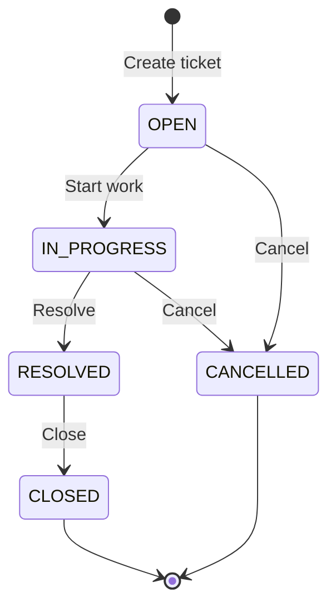

# State Machine

**Status:** Approved — GATE 6  
**Source:** `spec/requirements.md` (REQ-SM-*, DEC-03, DEC-10, DEC-14), `spec/api-contract.md`  
**Last updated:** 2026-09-24

Defines the ticket status lifecycle, valid and invalid transitions, enforcement rules, API behaviour, and integration test expectations.

---

## 1. Purpose

The backend **must** enforce a finite state machine for ticket `status` (REQ-SM-10). The UI may guide users but cannot bypass server rules (AC-11, AC-12).

Status changes occur **only** via:

- **Implicit:** `POST /api/tickets` → initial status `OPEN` (DEC-03)
- **Explicit:** `PATCH /api/tickets/{id}/status` with `{ "status": "<TARGET>" }` (DEC-10)

Status **cannot** be changed via `PATCH /api/tickets/{id}` field update.

---

## 2. States

| Status | Type | Description | Outbound transitions |
|--------|------|-------------|----------------------|
| `OPEN` | **Initial** | Ticket created; not yet worked | 2 |
| `IN_PROGRESS` | Active | Work in progress | 2 |
| `RESOLVED` | Active | Work complete; awaiting closure | 1 |
| `CLOSED` | **Terminal** | Ticket closed; no further changes | 0 |
| `CANCELLED` | **Terminal** | Ticket cancelled; no further changes | 0 |

**Terminal states** (`CLOSED`, `CANCELLED`): no valid outbound transitions. Any status change request from a terminal state is **rejected** (409).

---

## 3. State Diagram



---

## 4. Valid Transitions

Exactly **five** transitions are valid (REQ-SM-01 – REQ-SM-05):

| ID | From | To | User action (illustrative) |
|----|------|-----|--------------------------|
| **SM-VT-01** | `OPEN` | `IN_PROGRESS` | Start progress |
| **SM-VT-02** | `OPEN` | `CANCELLED` | Cancel ticket |
| **SM-VT-03** | `IN_PROGRESS` | `RESOLVED` | Mark resolved |
| **SM-VT-04** | `IN_PROGRESS` | `CANCELLED` | Cancel ticket |
| **SM-VT-05** | `RESOLVED` | `CLOSED` | Close ticket |

### 4.1 Happy-Path Chain

The primary lifecycle for a completed ticket:

```
OPEN → IN_PROGRESS → RESOLVED → CLOSED
```

Alternative exit from active work:

```
OPEN → CANCELLED
IN_PROGRESS → CANCELLED
```

---

## 5. Invalid Transitions

### 5.1 Rule

> Any transition **not** listed in Section 4 is **invalid** (REQ-SM-09, DEC-14).

This includes:

- Assignment examples (REQ-SM-06 – REQ-SM-08)
- Reopen transitions (e.g. `RESOLVED` → `IN_PROGRESS`)
- Skipping steps (e.g. `OPEN` → `RESOLVED`)
- Transitions from terminal states
- **Same-state** requests (e.g. `OPEN` → `OPEN`)

### 5.2 Assignment Examples (must reject)

| ID | From | To | Requirement |
|----|------|-----|-------------|
| **SM-IX-01** | `CLOSED` | `OPEN` | REQ-SM-06 |
| **SM-IX-02** | `RESOLVED` | `OPEN` | REQ-SM-07 |
| **SM-IX-03** | `CANCELLED` | `OPEN` | REQ-SM-08 |

### 5.3 Complete Transition Matrix

Rows = current status, columns = requested target status.  
✅ = valid | ❌ = invalid (409)

| From \ To | `OPEN` | `IN_PROGRESS` | `RESOLVED` | `CLOSED` | `CANCELLED` |
|-----------|--------|---------------|------------|----------|-------------|
| **OPEN** | ❌ | ✅ SM-VT-01 | ❌ | ❌ | ✅ SM-VT-02 |
| **IN_PROGRESS** | ❌ | ❌ | ✅ SM-VT-03 | ❌ | ✅ SM-VT-04 |
| **RESOLVED** | ❌ SM-IX-02 | ❌ | ❌ | ✅ SM-VT-05 | ❌ |
| **CLOSED** | ❌ SM-IX-01 | ❌ | ❌ | ❌ | ❌ |
| **CANCELLED** | ❌ SM-IX-03 | ❌ | ❌ | ❌ | ❌ |

**Total:** 5 valid, 20 invalid (including 5 same-state diagonals conceptually — none are valid).

### 5.4 Notable Invalid Transitions (for tests)

| From | To | Reason |
|------|-----|--------|
| `OPEN` | `RESOLVED` | Must pass through `IN_PROGRESS` |
| `OPEN` | `CLOSED` | Must pass through `IN_PROGRESS` → `RESOLVED` |
| `RESOLVED` | `IN_PROGRESS` | Reopen not allowed (DEC-14) |
| `RESOLVED` | `CANCELLED` | Cannot cancel after resolve |
| `CLOSED` | `IN_PROGRESS` | Terminal state |
| `CANCELLED` | `IN_PROGRESS` | Terminal state |
| `IN_PROGRESS` | `OPEN` | No backward transition defined |
| `*` | same status | Not a valid transition |

---

## 6. Enforcement

### 6.1 Component

| Layer | Responsibility |
|-------|----------------|
| `TicketStatusService` | Sole authority for status transitions (`spec/architecture.md`) |
| `TicketController` | Exposes `PATCH /api/tickets/{id}/status` |
| `TicketService` | Rejects `status` on field PATCH; delegates transitions to `TicketStatusService` |

### 6.2 Algorithm

```
1. Load ticket by id → 404 if not found
2. Parse requested status from request → 400 if missing/invalid enum
3. If currentStatus == requestedStatus → 409 (same-state)
4. If transition (currentStatus, requestedStatus) not in VALID_TRANSITIONS → 409
5. Set ticket.status = requestedStatus
6. Update ticket.updatedAt = now()
7. Persist and return TicketDetailResponse
```

### 6.3 Implementation Pattern

Use an explicit allow-list (recommended):

```java
// Illustrative — not implementation code
Map<TicketStatus, Set<TicketStatus>> VALID_TRANSITIONS = Map.of(
    OPEN,         Set.of(IN_PROGRESS, CANCELLED),
    IN_PROGRESS,  Set.of(RESOLVED, CANCELLED),
    RESOLVED,     Set.of(CLOSED),
    CLOSED,       Set.of(),
    CANCELLED,    Set.of()
);
```

No transition table in the database — logic stays in Java (testable, version-controlled).

### 6.4 Side Effects on Transition

| Effect | Behaviour |
|--------|-----------|
| `status` column | Updated to target status |
| `updated_at` | Set to current UTC time |
| Other fields | Unchanged |
| Comments | Unchanged |

Field updates (title, etc.) are **allowed** in any non-terminal state unless a future spec restricts them. Terminal tickets (`CLOSED`, `CANCELLED`) may still receive field updates and comments unless restricted later — **current decision:** field updates and comments **are allowed** on terminal tickets (assignment does not forbid).

---

## 7. API Behaviour

### 7.1 Endpoint

**`PATCH /api/tickets/{id}/status`**

Request body: `{ "status": "<TicketStatus>" }`

### 7.2 Response Codes

| Condition | HTTP | Error `error` field |
|-----------|------|---------------------|
| Success | **200** | — |
| Ticket not found | **404** | `Not Found` |
| Missing/invalid `status` in body | **400** | `Validation Failed` |
| Invalid transition | **409** | `Invalid Status Transition` |
| Same-state request | **409** | `Invalid Status Transition` |

### 7.3 Error Message Format

Invalid transition messages must be **human-readable** for UI display (REQ-FUNC-13):

```
Cannot transition from {CURRENT} to {REQUESTED}
```

Examples:

- `Cannot transition from CLOSED to OPEN`
- `Cannot transition from RESOLVED to IN_PROGRESS`
- `Cannot transition from OPEN to OPEN`

Response body per `spec/api-contract.md` §3.3.

---

## 8. UI Guidance (for GATE 7)

Available actions per current status — UI should **only offer** valid targets; backend still enforces if bypassed.

| Current status | Offered transitions |
|----------------|---------------------|
| `OPEN` | → `IN_PROGRESS`, → `CANCELLED` |
| `IN_PROGRESS` | → `RESOLVED`, → `CANCELLED` |
| `RESOLVED` | → `CLOSED` |
| `CLOSED` | *(none)* |
| `CANCELLED` | *(none)* |

---

## 9. Integration Test Requirements

Mandatory per REQ-NFR-04, AC-16, `.cursor/rules/testing.mdc`.

### 9.1 Valid Transition Tests (must pass)

| Test case | Transition |
|-----------|------------|
| SM-IT-01 | `OPEN` → `IN_PROGRESS` |
| SM-IT-02 | `OPEN` → `CANCELLED` |
| SM-IT-03 | `IN_PROGRESS` → `RESOLVED` |
| SM-IT-04 | `IN_PROGRESS` → `CANCELLED` |
| SM-IT-05 | `RESOLVED` → `CLOSED` |
| SM-IT-06 | Full chain `OPEN` → `IN_PROGRESS` → `RESOLVED` → `CLOSED` on single ticket |

### 9.2 Invalid Transition Tests (must return 409)

| Test case | Transition | Notes |
|-----------|------------|-------|
| SM-IT-07 | `CLOSED` → `OPEN` | REQ-SM-06 |
| SM-IT-08 | `RESOLVED` → `OPEN` | REQ-SM-07 |
| SM-IT-09 | `CANCELLED` → `OPEN` | REQ-SM-08 |
| SM-IT-10 | `RESOLVED` → `IN_PROGRESS` | DEC-14 |
| SM-IT-11 | `OPEN` → `RESOLVED` | Skip step |
| SM-IT-12 | `OPEN` → `OPEN` | Same-state |
| SM-IT-13 | `CLOSED` → `CANCELLED` | Terminal state |

Each invalid test must assert:

- HTTP status **409**
- Response `error` = `Invalid Status Transition`
- Response `message` contains current and requested status
- Database `status` unchanged after failed request

### 9.3 Related Tests (not state-machine-specific but required)

| Test case | Behaviour |
|-----------|-----------|
| SM-IT-14 | `status` in `PATCH /api/tickets/{id}` body → **400** |
| SM-IT-15 | New ticket via `POST /api/tickets` has status `OPEN` |

Detailed test strategy: `spec/test-strategy.md` (GATE 8).

---

## 10. Requirements Traceability

| Requirement | State machine element |
|-------------|----------------------|
| REQ-SM-01 – 05 | Section 4 valid transitions |
| REQ-SM-06 – 08 | Section 5.2 assignment invalid examples |
| REQ-SM-09 | Section 5.1, 5.3 complete matrix |
| REQ-SM-10 | Section 6 enforcement |
| REQ-SM-11 | Section 7 API errors |
| DEC-03 | Initial state `OPEN` |
| DEC-10 | Dedicated status endpoint |
| DEC-14 | No reopen; matrix Section 5.3 |
| AC-11 | Section 9.1 |
| AC-12 | Section 9.2 |

---

## 11. Out of Scope

- State transition history / audit log table
- Time-in-status metrics
- Role-based transition permissions
- Automatic transitions (e.g. auto-close after N days)
- Database triggers for state enforcement

---

## 12. Gate Approval

| Gate | Document | Status |
|------|----------|--------|
| GATE 1 – 5 | Prior specs | **Approved** |
| GATE 6 | This document (`spec/state-machine.md`) | **Approved** (2026-09-24) |
| GATE 7 | `spec/ui-flow.md` | Not started |
| GATE 8 | `spec/test-strategy.md` | Not started |

---

## 13. Revision History

| Date | Change | Gate |
|------|--------|------|
| 2026-09-24 | Initial state machine spec | GATE 6 |
| 2026-09-24 | GATE 6 approved | GATE 6 |
