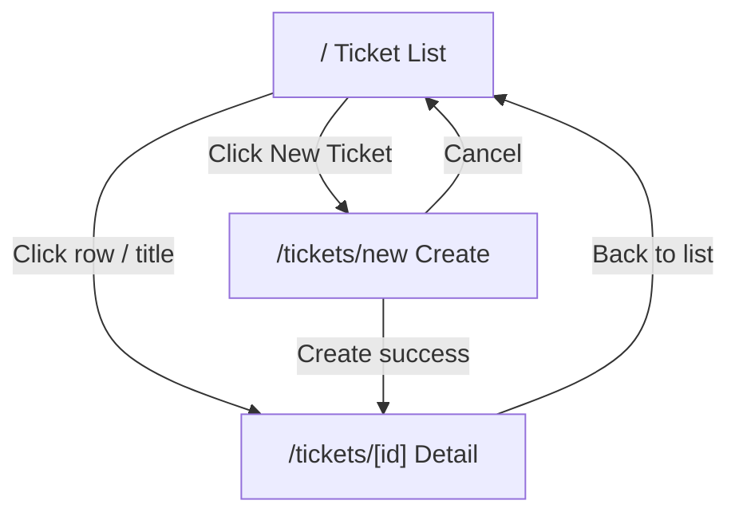

# UI Flow

**Status:** Approved — GATE 7  
**Source:** `spec/requirements.md`, `spec/architecture.md`, `spec/api-contract.md`, `spec/state-machine.md`  
**Last updated:** 2026-09-24

Defines screens, navigation, user actions, form behaviour, and error display for the Next.js frontend (DEC-11).

---

## 1. Principles

| Principle | Requirement trace |
|-----------|-------------------|
| Backend is authoritative for validation and state machine | REQ-FUNC-12, REQ-SM-10 |
| Display meaningful errors from API responses | REQ-FUNC-13 |
| Client-side validation improves UX only; server wins on conflict | DEC-08 |
| No authentication or login flow | DEC-06 |
| Status changes use dedicated UI action → `PATCH .../status` | DEC-10 |

---

## 2. Application Shell

### 2.1 Layout (`layout.tsx`)

- App title: **Support Ticket System**
- Persistent header with navigation link: **Tickets** → `/`
- Primary action in header: **New Ticket** → `/tickets/new`
- No user menu / logout (DEC-06)

### 2.2 Routes

| Route | Screen | Purpose |
|-------|--------|---------|
| `/` | Ticket List | List, search, filter (REQ-FUNC-02, 09, 10) |
| `/tickets/new` | Create Ticket | Create form (REQ-FUNC-01, AC-01) |
| `/tickets/[id]` | Ticket Detail | View, edit, status, comments (REQ-FUNC-03 – 08) |



---

## 3. Screen: Ticket List (`/`)

### 3.1 Purpose

Display all tickets with search and status filter (DEC-07, DEC-12, DEC-13).

### 3.2 API

`GET /api/tickets?search={q}&status={status}`

### 3.3 UI Elements

| Element | Type | Behaviour |
|---------|------|-----------|
| Search input | Text field | Debounced or on **Search** button submit; maps to `search` query param |
| Status filter | Dropdown | Options: **All**, `OPEN`, `IN_PROGRESS`, `RESOLVED`, `CLOSED`, `CANCELLED` |
| Apply / Search button | Button | Refetches list with current search + filter |
| Clear filters | Link/button | Resets search and filter to **All**; refetches |
| Ticket table | Table or card list | Columns per DEC-13 |
| New Ticket | Button (header) | Navigate to `/tickets/new` |
| Row link | Clickable title or row | Navigate to `/tickets/[id]` |

### 3.4 Table Columns

| Column | Source field | Display |
|--------|--------------|---------|
| ID | `id` | `#1` or plain number |
| Title | `title` | Truncate with ellipsis if long |
| Status | `status` | Badge with human label (e.g. "In Progress") |
| Priority | `priority` | Badge or text |
| Assignee | `assignee` | Value or **Unassigned** if `null` |
| Updated | `updatedAt` | Formatted local datetime |

### 3.5 States

| State | UI |
|-------|-----|
| Loading | Skeleton rows or spinner |
| Empty (no tickets) | Message: *No tickets yet. Create your first ticket.* + link to `/tickets/new` |
| Empty (no matches) | Message: *No tickets match your search.* |
| Error | Error banner with API `message` (§8) |
| Success | Render ticket rows |

### 3.6 User Flow

1. User lands on `/` → fetch `GET /api/tickets`
2. User types keyword, selects status, clicks Search → fetch with params
3. User clicks ticket → navigate to `/tickets/{id}`

---

## 4. Screen: Create Ticket (`/tickets/new`)

### 4.1 Purpose

Create a new ticket (AC-01).

### 4.2 API

`POST /api/tickets`

### 4.3 Form Fields

| Field | Control | Required | Default | Validation (client) |
|-------|---------|----------|---------|---------------------|
| Title | Text input | yes | — | Non-empty; max 200 chars |
| Description | Textarea | yes | — | Non-empty; max 5000 chars |
| Priority | Select | no | `MEDIUM` | `LOW` \| `MEDIUM` \| `HIGH` |
| Assignee | Text input | no | empty | Max 100 chars |

`status` is **not** shown (always `OPEN` server-side, DEC-03).

### 4.4 Actions

| Action | Behaviour |
|--------|-----------|
| **Create** | Submit form → `POST /api/tickets` |
| **Cancel** | Navigate to `/` without saving |

### 4.5 Success Flow

1. API returns **201** with `TicketDetailResponse`
2. Show brief success feedback (optional toast or inline message)
3. Navigate to `/tickets/{id}` for the new ticket

### 4.6 Error Flow

| API response | UI behaviour |
|--------------|--------------|
| **400** with `fieldErrors` | Show inline errors next to fields + summary banner |
| **400** with `message` only | Show banner with `message` |
| **500** / network error | Show banner: *Unable to create ticket. Please try again.* |

---

## 5. Screen: Ticket Detail (`/tickets/[id]`)

### 5.1 Purpose

View ticket details, update fields, transition status, add comments (AC-03 – AC-08, AC-11).

### 5.2 API

| Action | API |
|--------|-----|
| Load | `GET /api/tickets/{id}` |
| Update fields | `PATCH /api/tickets/{id}` |
| Change status | `PATCH /api/tickets/{id}/status` |
| Add comment | `POST /api/tickets/{id}/comments` |

### 5.3 Layout Sections

```text
┌─────────────────────────────────────────┐
│ ← Back to list          Ticket #123     │
├─────────────────────────────────────────┤
│ [Status badge]  [Priority]  Updated: …  │
├─────────────────────────────────────────┤
│ Ticket details (editable)               │
│   Title, Description, Priority, Assignee│
│   [Save changes]                        │
├─────────────────────────────────────────┤
│ Status actions                          │
│   [contextual buttons per §5.5]         │
├─────────────────────────────────────────┤
│ Comments                                │
│   Comment list (oldest first)           │
│   Add comment form                      │
└─────────────────────────────────────────┘
```

### 5.4 Editable Fields (Save Section)

| Field | Control | Notes |
|-------|---------|-------|
| Title | Text input | PATCH on save |
| Description | Textarea | PATCH on save |
| Priority | Select | PATCH on save |
| Assignee | Text input | Empty clears assignee (`null`) |

**Save** sends only changed fields (or all fields) via `PATCH /api/tickets/{id}`.  
Read-only display: `id`, `status`, `createdAt`, `updatedAt`.

### 5.5 Status Actions (`StatusTransition` component)

Buttons shown **only** for valid targets per `spec/state-machine.md` §8:

| Current status | Buttons shown | API target |
|----------------|---------------|------------|
| `OPEN` | **Start Progress**, **Cancel Ticket** | `IN_PROGRESS`, `CANCELLED` |
| `IN_PROGRESS` | **Mark Resolved**, **Cancel Ticket** | `RESOLVED`, `CANCELLED` |
| `RESOLVED` | **Close Ticket** | `CLOSED` |
| `CLOSED` | *(none — message: Ticket is closed)* | — |
| `CANCELLED` | *(none — message: Ticket is cancelled)* | — |

Each button:

1. Optional confirmation for destructive actions (`CANCELLED`) — recommended but not required
2. Calls `PATCH /api/tickets/{id}/status` with `{ "status": "<TARGET>" }`
3. On **200**: refresh ticket detail; update status badge and available buttons
4. On **409**: show error banner with API `message` (e.g. *Cannot transition from CLOSED to OPEN*)

### 5.6 Comments Section

#### Comment list (`CommentList`)

- Display `comments` from ticket detail, ordered by `createdAt` ascending
- Each item: `body`, `author` (or **Anonymous** if null), formatted `createdAt`
- Empty state: *No comments yet.*

#### Add comment (`CommentForm`)

| Field | Control | Required |
|-------|---------|----------|
| Body | Textarea | yes |
| Author | Text input | no |

**Add Comment** → `POST /api/tickets/{id}/comments`

Success:

1. Clear form (or clear body only)
2. Refetch ticket detail **or** append returned `CommentResponse` to list
3. Parent ticket `updatedAt` refreshes (DM-01)

### 5.7 Detail Page States

| State | UI |
|-------|-----|
| Loading | Spinner or skeleton |
| Not found (**404**) | Message: *Ticket not found.* + link to `/` |
| Load error | Error banner |
| Save success | Inline success: *Changes saved.* |
| Save validation error | Field errors + banner |
| Status error (**409**) | Banner with transition message |

### 5.8 Back Navigation

**← Back to list** → `/` (preserves list filters if passed via query state optional; not required for assessment).

---

## 6. Error Display (`ErrorMessage` component)

### 6.1 API Error Parsing

Parse response body from `lib/api/client.ts`:

| Field | UI use |
|-------|--------|
| `message` | Primary banner text |
| `fieldErrors[]` | Inline under matching form fields |
| `fieldErrors[].field` | Map to input `name` / `id` |
| `fieldErrors[].message` | Inline error text |
| `status` | Distinguish 400 vs 409 vs 404 vs 500 |

### 6.2 Display Patterns

| Pattern | When | Example |
|---------|------|---------|
| **Banner** (top of form/section) | General or API `message` | Red/alert box with `message` |
| **Inline field error** | `fieldErrors` present | Red text below input |
| **Summary list** | Multiple field errors | Bullet list above form |

### 6.3 Examples

**Validation (400):**

```text
⚠ One or more fields are invalid
  • title: must not be blank
```

**Invalid transition (409):**

```text
⚠ Cannot transition from CLOSED to OPEN
```

**Not found (404):**

```text
⚠ Ticket not found with id: 42
```

### 6.4 Network / Unknown Errors

When `fetch` fails or body is not JSON:

```text
⚠ Unable to reach the server. Please check your connection and try again.
```

---

## 7. Client-Side Validation (UX)

Run before submit; **do not block** submit if only server would catch edge cases — but prevent obvious empty submits.

| Form | Client rules |
|------|--------------|
| Create ticket | Title + description non-empty |
| Update ticket | If field edited, apply same length rules |
| Add comment | Body non-empty |
| List filter | Invalid status not possible (dropdown only) |

On client validation failure: show inline errors **without** API call.

---

## 8. Status & Priority Labels (Display)

Human-friendly labels in UI; API values unchanged.

| API value | Display label |
|-----------|---------------|
| `OPEN` | Open |
| `IN_PROGRESS` | In Progress |
| `RESOLVED` | Resolved |
| `CLOSED` | Closed |
| `CANCELLED` | Cancelled |
| `LOW` | Low |
| `MEDIUM` | Medium |
| `HIGH` | High |

Optional colour coding for status badges (implementation choice):

| Status | Suggested tone |
|--------|----------------|
| `OPEN` | Neutral / blue |
| `IN_PROGRESS` | Active / yellow |
| `RESOLVED` | Success / green |
| `CLOSED` | Muted / gray |
| `CANCELLED` | Muted / red |

---

## 9. Loading & Interaction Feedback

| Interaction | Feedback |
|-------------|----------|
| List fetch | Loading indicator on table |
| Form submit | Disable submit button; show *Saving…* / *Creating…* |
| Status button click | Disable button during request |
| Successful save | Brief success message or updated fields |

Prevent double-submit on create and status transitions.

---

## 10. Acceptance Criteria Mapping

| AC | UI flow |
|----|---------|
| AC-01 | §4 Create ticket |
| AC-02 | §3 Ticket list |
| AC-03 | §5 Ticket detail view |
| AC-04 – AC-07 | §5.4 Save fields |
| AC-08 | §5.6 Add comment |
| AC-09 | §3 search input |
| AC-10 | §3 status filter |
| AC-11 | §5.5 status buttons |
| AC-12 | §5.5 — backend rejects; UI shows 409 message |
| AC-15 | §6 Error display |

---

## 11. Out of Scope (UI)

- Login / registration screens
- Ticket delete confirmation
- Comment edit/delete
- Pagination controls
- Real-time updates / polling
- Mobile-specific layouts (responsive CSS is fine; no separate spec)
- Dark mode toggle
- Toast notification library (optional at implementation)

---

## 12. Gate Approval

| Gate | Document | Status |
|------|----------|--------|
| GATE 1 – 6 | Prior specs | **Approved** |
| GATE 7 | This document (`spec/ui-flow.md`) | **Approved** (2026-09-24) |
| GATE 8 | `spec/test-strategy.md` | Not started |

---

## 13. Revision History

| Date | Change | Gate |
|------|--------|------|
| 2026-09-24 | Initial UI flow spec | GATE 7 |
| 2026-09-24 | GATE 7 approved | GATE 7 |
